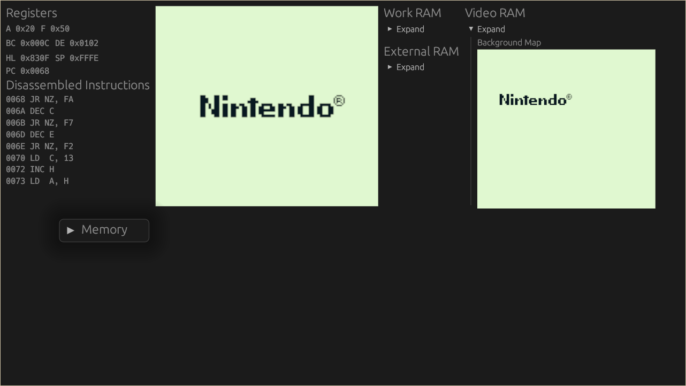

## Gameboy emulator made in rust
Work in progress.
State of the project:
- CPU emulation done
- Boot ROM runs fine
- Pixel Processing Unit in progress
- GUI with debug informations
- Can generate flamegraphs using `tracing` and `inferno-flamegraph`

Screenshot:

